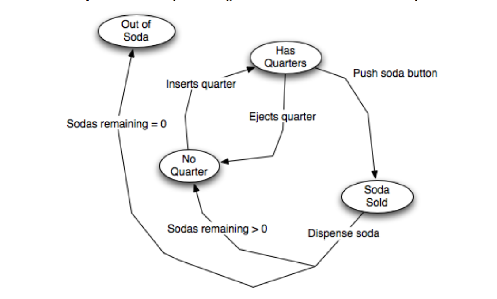
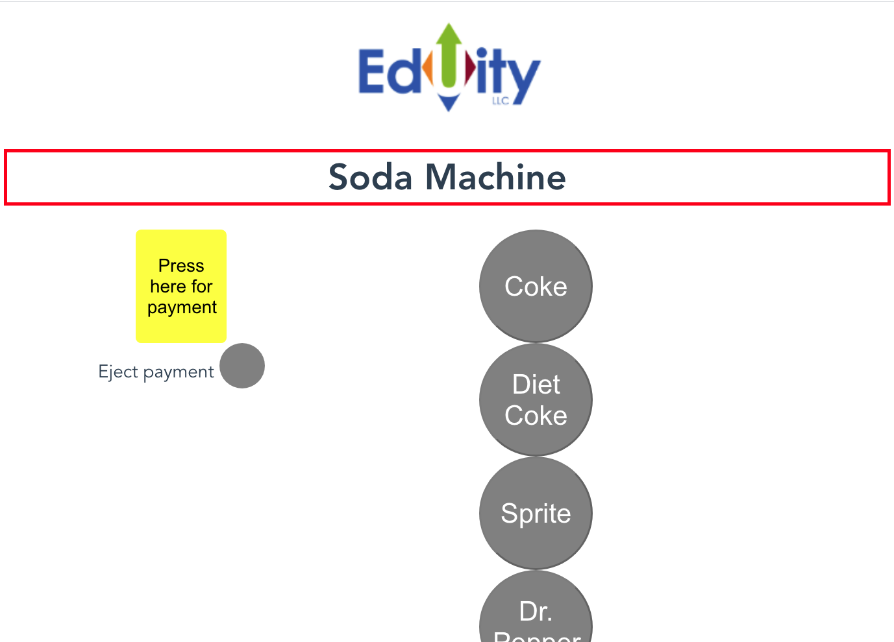
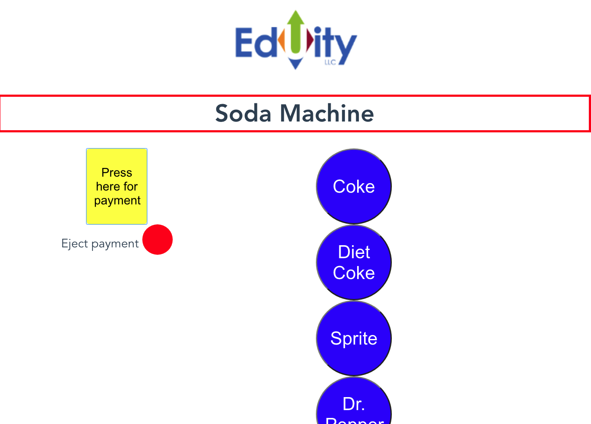

# Soda Machine
The Eduity soda machine is a coding challenge. The requirements asked for a soda machine built in vue.js that functioned like this diagram:


The machine initially only has 1 button available to the user and is in the ready to accept mayment mode. Only the submit payment button is active in this state. 


Once the submit payment button is pressed the machine is in ready to vend state. The user can then eject his money and the machine will return to ready to accept payment mode and the soda buttons will again be disabled. Or the user can choose the soda they wish to purchase. 


The soda buttons are only available when there has been payment and there are sodas avaailable to purchase. If a soda type is sold out, that button will be disabled. Once the soda has been vended, the machine will return to the ready for payment mode where only the submit payment button is active. 

## Project setup
```
Clone https://github.com/mbrownlee/Soda-Machine onto your machine and cd into this directory 
npm install
vue ui allows you to use the GUI on the dom
```

### Compiles and hot-reloads for development
```
npm run serve
```

### Compiles and minifies for production
```
npm run build
```

### Lints and fixes files
```
npm run lint
```

### Customize configuration
See [Configuration Reference](https://cli.vuejs.org/config/).
